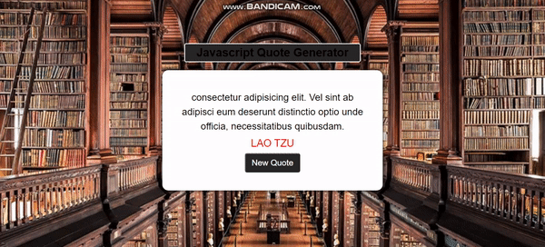
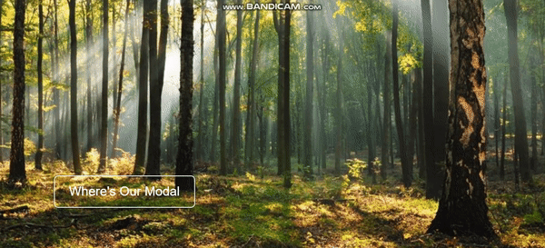
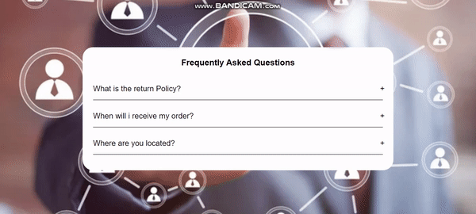
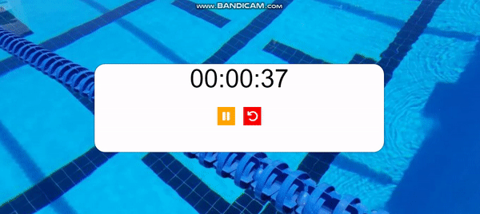
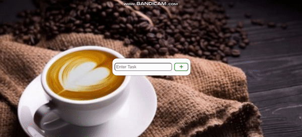

<h1 align="center">Basic-DOM-Projects</h1>

<h3>Overview</h3>
👨‍💻 In this projects I mastered basic DOM skills. I used mainly HTML, CSS and JS (DOM Manipulation). You can see visual demo of the website below. The objective is to build out this real-like webpage and make it looking as professional as possible..

## ✨ Project-1

 

     

<!-- ------------------------------------------------------ -->

## ✨ Project-2

 

     

<!-- ------------------------------------------------------ -->

## ✨ Project-3

 

     

<!-- ------------------------------------------------------ -->

## ✨ Project-4

 

     

<!-- ------------------------------------------------------ -->

## ✨ Project-5

 

     

<!-- ------------------------------------------------------------------------------------- -->
## Author

👤 **Yasin Sutoglu**

- Twitter: [@YsnStgl](https://twitter.com/YsnStgl)
- Github: [@yasinsutoglu](https://github.com/yasinsutoglu)

